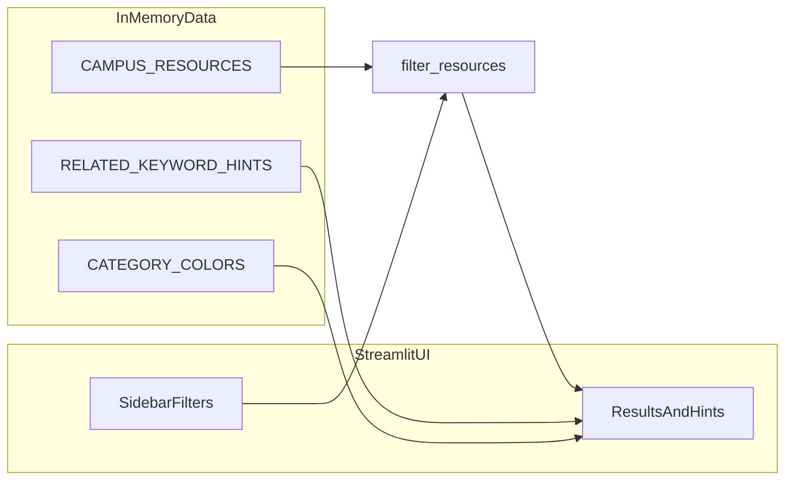

# GIX Campus Wayfinder（GIX 校园资源导览）

基于 **Streamlit** 的单文件 Web 应用，用于浏览与检索 GIX 楼宇内的实验室、学习空间、服务与餐饮等资源。所有数据以内嵌 Python 数据结构形式存放在 `app.py` 中，无需外部数据库。

| 项目     | 说明 |
| -------- | ---- |
| 课程     | TECHIN 510 — Programming for Digital and Physical Interfaces |
| 技术栈   | Python 3.11+、Streamlit ≥ 1.30 |
| 入口文件 | `app.py` |
| 依赖声明 | `requirements.txt` |

> 说明：本仓库 `lab1/` 根目录下另有课程相关应用（采购流程等）。**GIX Wayfinder** 独立位于子目录 `lab1/lab1_GIX Wayfinder/`，运行请进入该目录后执行下方命令。

---

## 功能概览

- **关键词搜索**：在资源名称、描述与标签中做**不区分大小写**的子串匹配。
- **分类筛选**：下拉选择类别（与数据中的 `category` 一致）。
- **地点筛选**：下拉选择楼宇/楼层描述（与数据中的 `location` 一致）。
- **组合逻辑**：分类、地点、关键词同时生效时为 **AND**（须全部满足）。
- **无结果提示**：无匹配时展示说明；若关键词命中预设意图，会按主题推荐相关类别下的资源（见 `RELATED_KEYWORD_HINTS`）。
- **结果展示**：按名称排序；以可展开卡片展示地点、开放时间、联系方式与描述；活跃筛选条件以徽章形式展示。

---

## 目录结构

```
lab1_GIX Wayfinder/
├── app.py              # 数据、业务逻辑与 Streamlit UI（单文件）
├── requirements.txt    # Python 依赖
└── README.md           # 本说明
```

---

## 环境与安装

1. 进入本目录（从仓库根 `510_Projects` 出发时）：

   ```powershell
   cd lab1\lab1_GIX Wayfinder
   ```

2. 创建并激活虚拟环境（Windows PowerShell 示例）：

   ```powershell
   python -m venv .venv
   .\.venv\Scripts\Activate.ps1
   ```

3. 安装依赖：

   ```powershell
   pip install -r requirements.txt
   ```

---

## 运行

```powershell
streamlit run app.py
```

浏览器中打开终端提示的本地地址即可使用。

---

## 数据结构

以下结构均在 `app.py` 模块顶层定义，应用启动时加载到内存。

### 1. `CAMPUS_RESOURCES`

- **类型**：`List[Dict[str, Any]]`
- **含义**：校园资源列表，每一项表示一个地点/服务。

每条资源字典**必须**包含以下键（与模块内 `_REQUIRED_RESOURCE_KEYS` 一致）：

| 字段 | 类型 | 说明 |
| ---- | ---- | ---- |
| `name` | `str` | 资源名称 |
| `category` | `str` | 类别，必须是 `CATEGORY_COLORS` 中已配置的键之一 |
| `location` | `str` | 位置描述（如楼层区域） |
| `description` | `str` | 详细说明 |
| `hours` | `str` | 开放时间（人类可读字符串） |
| `contact` | `str` | 联系邮箱或说明 |
| `tags` | `List[str]` | 检索用标签列表，关键词会匹配各标签子串 |

### 2. `CATEGORY_COLORS`

- **类型**：`Dict[str, str]`
- **含义**：类别 → 徽章用的十六进制颜色（如 `#FF6B6B`），用于 UI 与「当前筛选」展示。

当前数据使用的类别键包括：`Lab`、`Study Space`、`Office`、`Service`、`Dining`。

### 3. `RELATED_KEYWORD_HINTS`

- **类型**：`List[Dict[str, Any]]`
- **含义**：当**当前筛选无结果**时，根据用户输入的关键词是否包含某些**触发子串**（`triggers`），给出友好推荐区块。

每条提示字典包含：

| 字段 | 类型 | 说明 |
| ---- | ---- | ---- |
| `triggers` | `List[str]` | 小写子串列表；若用户查询（转小写后）包含任一子串则命中 |
| `categories` | `List[str]` | 建议展示的类别名集合，与资源上的 `category` 对应 |
| `title` | `str` | 推荐区块标题 |
| `caption` | `str` | 推荐区块说明文字 |

推荐资源由 `resources_for_categories` 从 `CAMPUS_RESOURCES` 中按类别过滤后按名称排序展示。

### 4. 启动时数据校验

模块末尾使用 `assert` 校验：

- 每条资源的键集包含全部必填键；
- `tags` 均为列表；
- 每条资源的 `category` 均存在于 `CATEGORY_COLORS`。

若数据不符合约定，应用导入阶段即失败，避免静默错误。

---

## 处理流程（筛选与排序）

1. **`filter_resources(resources, search_query, category, location)`**
   - 若 `category` 不是 `"All"`，只保留 `resource["category"]` 相等的项。
   - 若 `location` 不是 `"All"`，只保留 `resource["location"]` 相等的项。
   - 若 `search_query` 非空，调用 `matches_search`：在 `name`、`description`、各 `tags` 中做不区分大小写的子串匹配。
   - 结果按 `name` 字母序排序。

2. **无结果时**：在提示信息之外，对 `search_query` 调用 `collect_related_hints`，对命中的每条 hint 展示对应类别下的资源（去重），帮助新用户发现相关设施。

---

## 数据流示意



---

## 许可证与课程说明

本项目为课程作业用途；数据为示例性质，不保证与真实校园开放信息完全一致。
