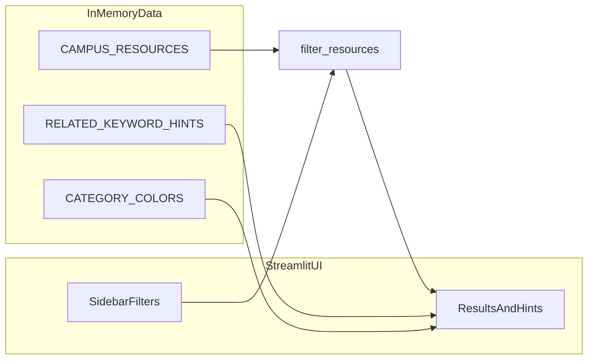

# GIX Campus Wayfinder

A single-file **Streamlit** web app for browsing and searching labs, study spaces, services, dining, and other resources in the GIX building. All data lives in embedded Python structures inside `app.py`; no external database is required.

| Item | Details |
| ---- | ------- |
| Course | TECHIN 510 — Programming for Digital and Physical Interfaces |
| Stack | Python 3.11+, Streamlit ≥ 1.30 |
| Entry point | `app.py` |
| Dependencies | `requirements.txt` |

> **Note:** `lab1/` holds two sibling apps. **GIX Wayfinder** is this folder (`lab1/lab1_GIX Wayfinder/`). Dorothy’s **Purchase Request Manager** is in `lab1/lab1_Dorothy_Dashboard/`. Run the commands below from this Wayfinder subdirectory.

---

## Features

- **Keyword search:** Case-insensitive substring match across resource `name`, `description`, and `tags`.
- **Category filter:** Dropdown values match each resource’s `category`.
- **Location filter:** Dropdown values match each resource’s `location` (building / area text).
- **Combined logic:** Category, location, and keyword filters use **AND** semantics (all active constraints must pass).
- **Empty state:** Shows guidance when nothing matches; if the query matches common intents, themed suggestions pull resources from related categories (see `RELATED_KEYWORD_HINTS`).
- **Results:** Sorted by `name`; expandable cards for location, hours, contact, and description; active filters shown as badges.

---

## Directory layout

```
lab1_GIX Wayfinder/
├── app.py              # Data, logic, and Streamlit UI (single file)
├── requirements.txt    # Python dependencies
└── README.md           # This file
```

---

## Setup

1. Go to this folder (from the `510_Projects` repo root; quote the path because of the space in the folder name):

   ```powershell
   cd lab1
   cd "lab1_GIX Wayfinder"
   ```

2. Create and activate a virtual environment (Windows PowerShell example):

   ```powershell
   python -m venv .venv
   .\.venv\Scripts\Activate.ps1
   ```

3. Install dependencies:

   ```powershell
   pip install -r requirements.txt
   ```

---

## Run

```powershell
streamlit run app.py
```

Open the local URL printed in the terminal.

---

## Data structures

These are defined at module scope in `app.py` and loaded in memory at import time.

### 1. `CAMPUS_RESOURCES`

- **Type:** `List[Dict[str, Any]]`
- **Purpose:** List of campus resources; each dict is one place or service.

Each resource dict **must** include the keys below (same set as `_REQUIRED_RESOURCE_KEYS`):

| Field | Type | Description |
| ----- | ---- | ----------- |
| `name` | `str` | Display name |
| `category` | `str` | Category; must be a key in `CATEGORY_COLORS` |
| `location` | `str` | Location text (e.g. floor / wing) |
| `description` | `str` | Longer description |
| `hours` | `str` | Hours of operation (human-readable) |
| `contact` | `str` | Email or contact note |
| `tags` | `List[str]` | Search tags; keyword search matches substrings in each tag |

### 2. `CATEGORY_COLORS`

- **Type:** `Dict[str, str]`
- **Purpose:** Maps each `category` to a hex color for badges and “active filter” UI.

Categories used in the sample data: `Lab`, `Study Space`, `Office`, `Service`, `Dining`.

### 3. `RELATED_KEYWORD_HINTS`

- **Type:** `List[Dict[str, Any]]`
- **Purpose:** When the **current filters return no rows**, the app checks whether the user’s query contains any **trigger** substrings (`triggers`). If so, it shows a friendly block suggesting resources in the listed `categories`.

Each hint dict contains:

| Field | Type | Description |
| ----- | ---- | ----------- |
| `triggers` | `List[str]` | Lowercase substrings; a hint applies if the lowercased query contains any of them |
| `categories` | `List[str]` | Category names to suggest; must match `category` on resources |
| `title` | `str` | Section heading for the suggestion block |
| `caption` | `str` | Short explanatory text under the heading |

Suggested rows come from `resources_for_categories`, which filters `CAMPUS_RESOURCES` by those categories and sorts by `name`.

### 4. Startup validation

An `assert` at the bottom of `app.py` enforces:

- Every resource includes all required keys.
- Every `tags` value is a list.
- Every `category` exists in `CATEGORY_COLORS`.

If data violates these rules, import fails immediately instead of failing silently at runtime.

---

## Processing flow (filtering and sorting)

1. **`filter_resources(resources, search_query, category, location)`**
   - If `category` is not `"All"`, keep only rows where `resource["category"]` matches.
   - If `location` is not `"All"`, keep only rows where `resource["location"]` matches.
   - If `search_query` is non-empty, `matches_search` runs case-insensitive substring checks on `name`, `description`, and each entry in `tags`.
   - Results are sorted alphabetically by `name`.

2. **No matches:** Besides the info message, `collect_related_hints` runs on `search_query`. For each matching hint, the app lists resources in the suggested categories (deduplicated) to help new users find related facilities.

---

## Data flow (diagram)



---

## Course / disclaimer

Built for a course assignment. Sample data is illustrative and may not match real campus hours or policies.
